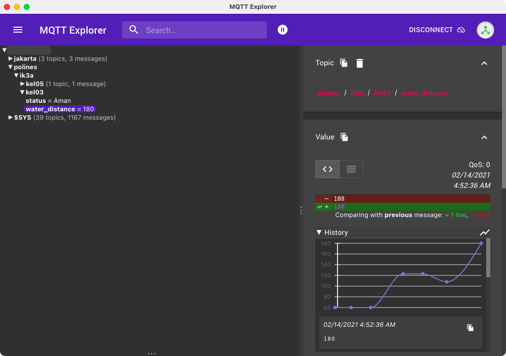
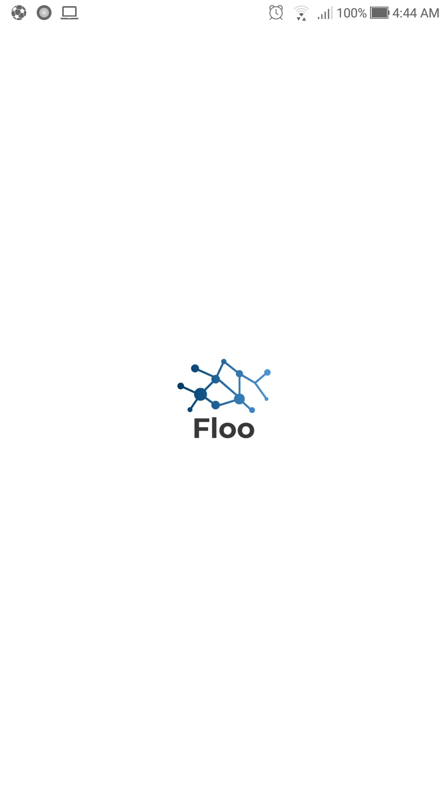
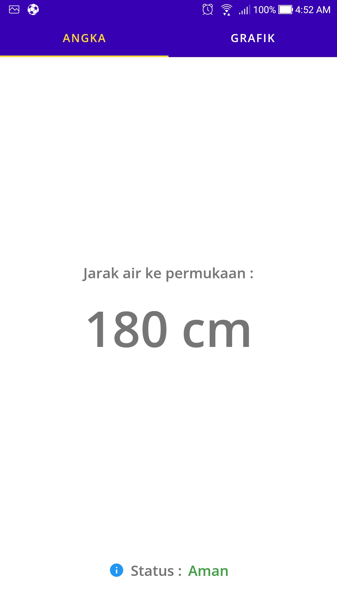
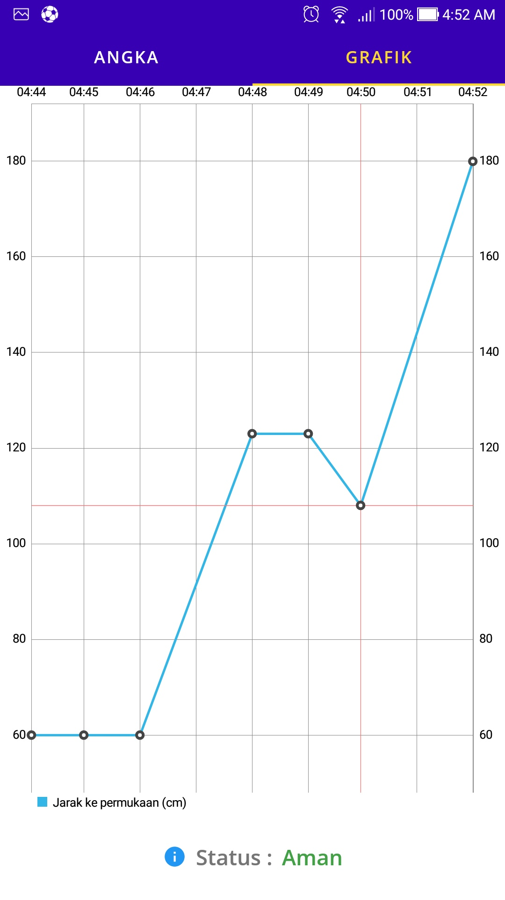

### [CourseWork] Floo App

---

##### This is an example of a flood monitoring application

---

###### Created at :

16 February 2021

###### Built using :

Kotlin, MVVM, Clean Architecture, Hilt, Architecture Component, Coroutines, Kotlin Flow, Paho MQTT,  MPChartAndroid.

---

##### Screenshot

- Server
  
  

- Splash
  
  

- Text
  
  

- Graph
  
  
